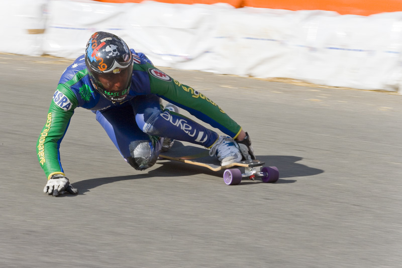

# lonboard



[CC-BY from Wikipedia](https://commons.wikimedia.org/wiki/File:Longboard.JPG)

> This is a new binding to the [deck.gl](https://deck.gl) geospatial data visualization library. A "deck" is the part of a skateboard you ride on. What's a fast, geospatial skateboard? A <em>lon</em>board.

## Install

This project requires [npm](https://www.npmjs.com/), [python](https://www.python.org/downloads/)>=3.11 and [poetry](https://python-poetry.org/).

```bash
npm install esbuild
npm run build
poetry install
```
