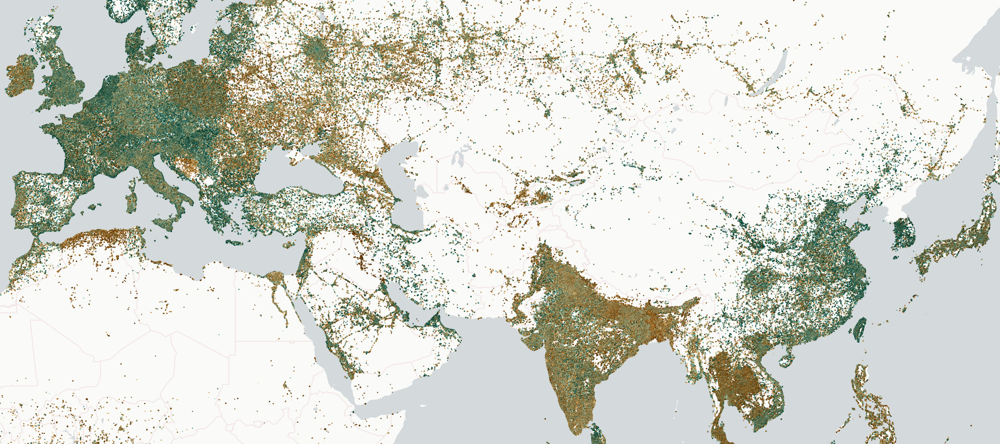

# lonboard



## Install

```
pip install --pre lonboard
```

## Why the name?


[CC-BY from Wikipedia](https://commons.wikimedia.org/wiki/File:Longboard.JPG)

> This is a new binding to the [deck.gl](https://deck.gl) geospatial data visualization library. A "deck" is the part of a skateboard you ride on. What's a fast, geospatial skateboard? A <em>lon</em>board.
