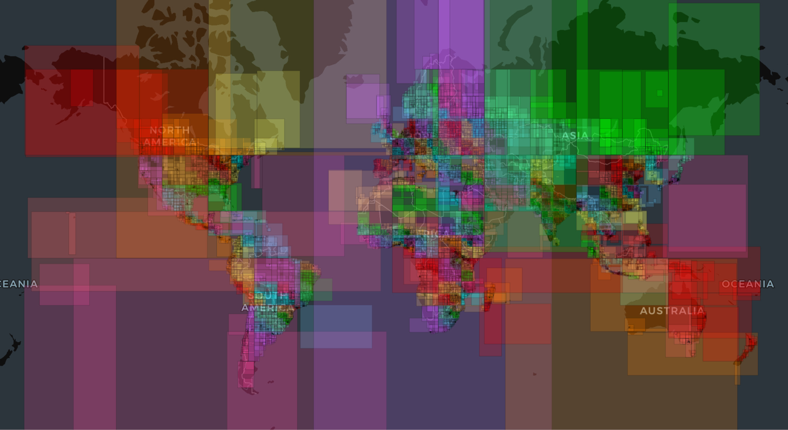
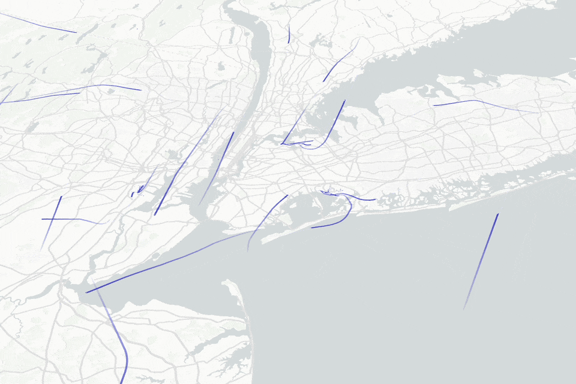
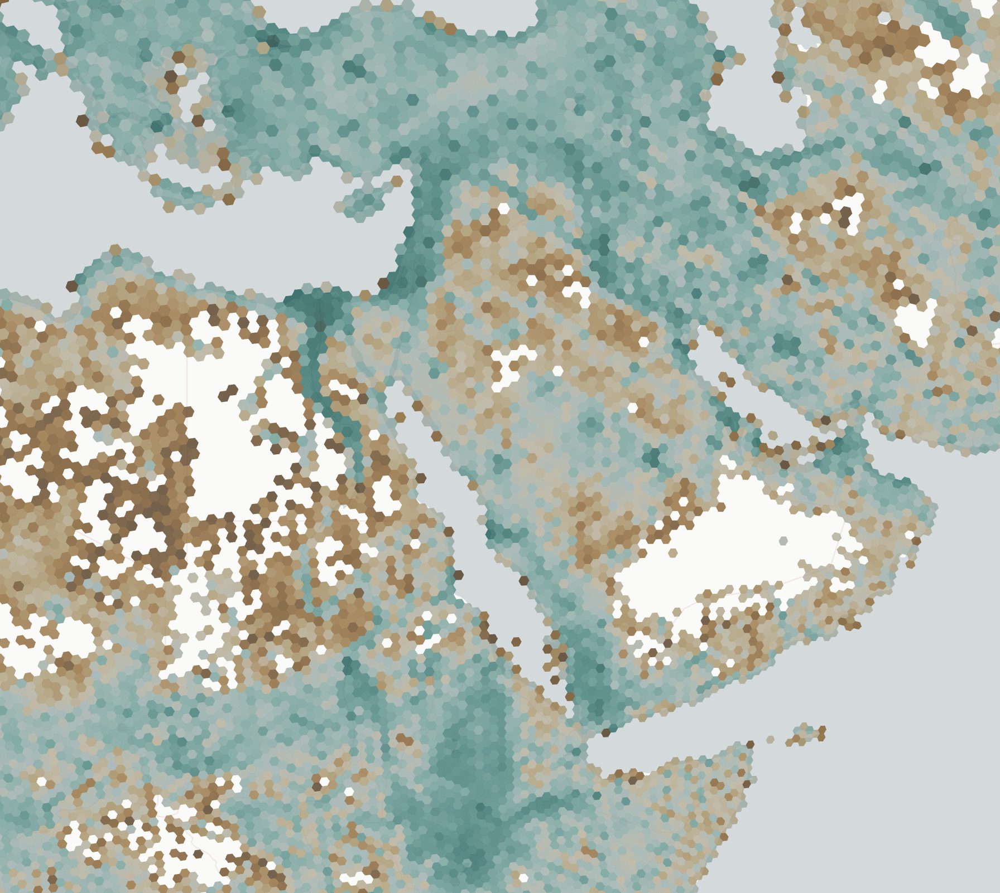
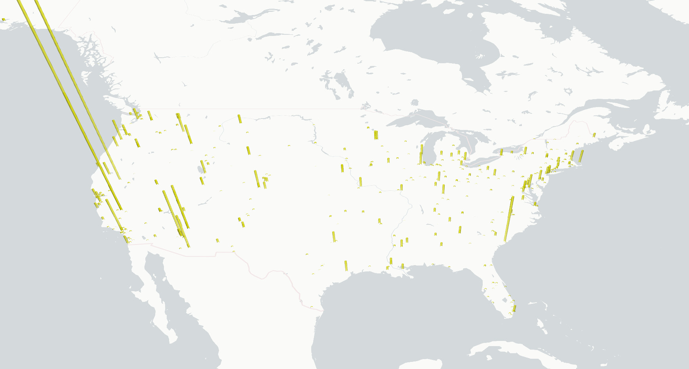
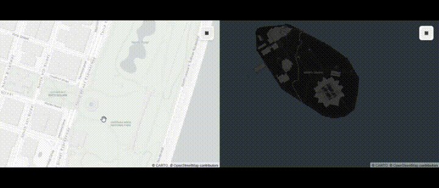
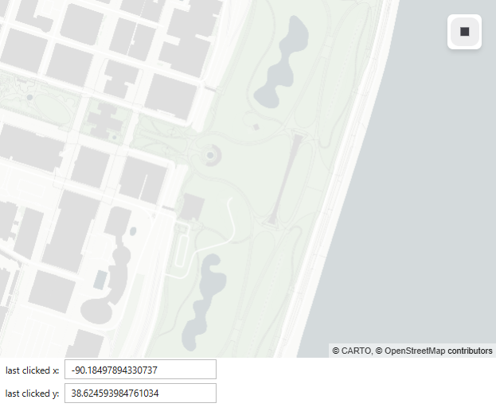
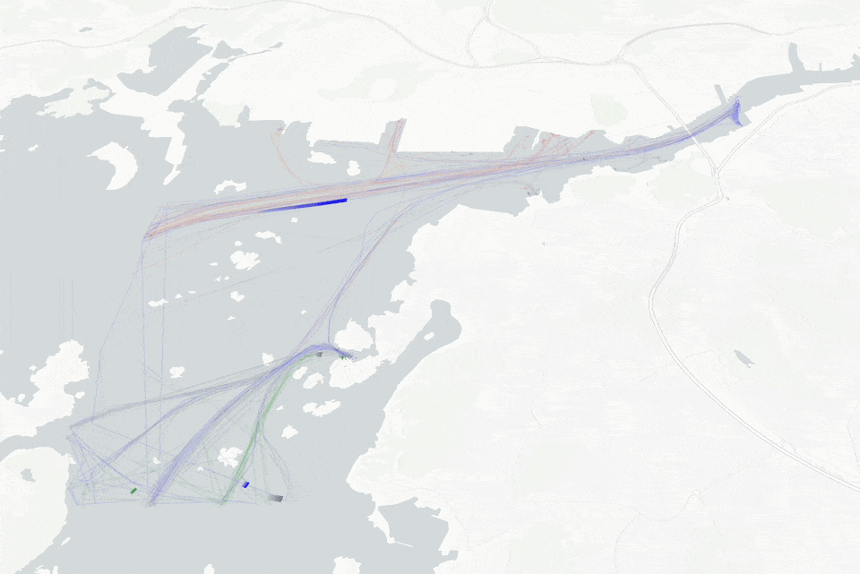
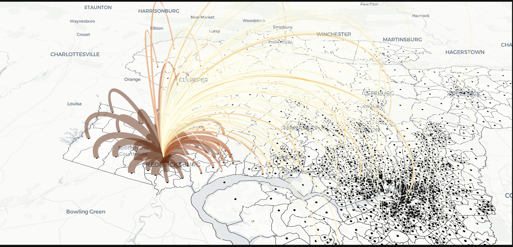

# Examples

- [Speedtest data ](../examples/internet-speeds) using [`ScatterplotLayer`][lonboard.ScatterplotLayer]
- [North America roads ](../examples/north-america-roads) using [`PathLayer`][lonboard.PathLayer]
- [Spatially-Partitioned GeoParquet ](../examples/overture-geoparquet) using [`PolygonLayer`][lonboard.PolygonLayer]
- [Overture Maps buildings ](../examples/overture-maps) using [`PolygonLayer`][lonboard.PolygonLayer]
- [Air Traffic Control animation ](../examples/air-traffic-control) using [`TripsLayer`][lonboard.TripsLayer]
- [Global boundaries ](../examples/global-boundaries) using [`PolygonLayer`][lonboard.PolygonLayer]
- [H3 Population Data ](../examples/kontur_pop) using [`H3HexagonLayer`][lonboard.H3HexagonLayer]
- [U.S. County-to-County Migration ](../examples/migration) using [`ArcLayer`][lonboard.ArcLayer] and [`BrushingExtension`][lonboard.layer_extension.BrushingExtension]
- [Scatterplot with GPU data filtering ](../examples/data-filter-extension) using [`ScatterplotLayer`][lonboard.ScatterplotLayer] and [`DataFilterExtension`][lonboard.layer_extension.DataFilterExtension]
-  [Motor Vehicle Crashes in NYC ](../examples/map_challenge/1-points) using [`ScatterplotLayer`][lonboard.ScatterplotLayer]
-  [Rivers in Asia ](../examples/map_challenge/6-asia/) using [`PathLayer`][lonboard.PathLayer]
-  [Inflation Reduction Act Projects ](../examples/column-layer/) using [`ColumnLayer`][lonboard.ColumnLayer]
-  [Interleaved Maplibre Labels ](../examples/interleaved-labels/) using [`BitmapLayer`][lonboard.BitmapLayer] and [`MaplibreBasemap`][lonboard.basemap.MaplibreBasemap]
-  [Linked Maps ](../examples/linked-maps/)
-  [Clicked Point ](../examples/clicked-point/)

## Integrations

-  [Marimo
        <video controls autoplay loop>
            <source src="https://github.com/user-attachments/assets/77f6a2b3-80c9-4524-8be2-79152746da1d" type="video/mp4">
        </video>
    ](../examples/marimo/nyc_taxi_trips/) using [`ArcLayer`][lonboard.ArcLayer] & [GeoDataFusion](https://github.com/datafusion-contrib/datafusion-geo)
-  [DuckDB Spatial ](../examples/duckdb) using [`HeatmapLayer`][lonboard.HeatmapLayer]
-  [Color picker integration ](../examples/integrations/color-picker) using [`SolidPolygonLayer`][lonboard.SolidPolygonLayer]
-  [JupyterLab Sidecar integration ](../examples/integrations/sidecar/) using [`ScatterplotLayer`][lonboard.ScatterplotLayer] and [`JupyterLab Sidecar`](https://github.com/jupyter-widgets/jupyterlab-sidecar)
-  [MovingPandas ](../examples/ais-movingpandas) using [`TripsLayer`][lonboard.TripsLayer]

## Third-party showcase

These examples are maintained by external contributors.

- [Using Lonboard to visualize graph flows ](https://knaaptime.com/longraph/) using [`ArcLayer`][lonboard.ArcLayer], [`PolygonLayer`][lonboard.PolygonLayer], and [`BrushingExtension`][lonboard.layer_extension.BrushingExtension] by [@knaaptime](https://github.com/knaaptime).
- [American Community Survey exploration](https://github.com/jaanli/lonboard/blob/1af815ea586121dbbe0d8cae70f7814a642ad165/examples/american-community-survey.ipynb) using [`ScatterplotLayer`][lonboard.ScatterplotLayer] and [`DataFilterExtension`][lonboard.layer_extension.DataFilterExtension] by [@jaanli](https://github.com/jaanli).

Want to add your own example? Create an issue or pull request on the [Lonboard repository](https://github.com/developmentseed/lonboard).
