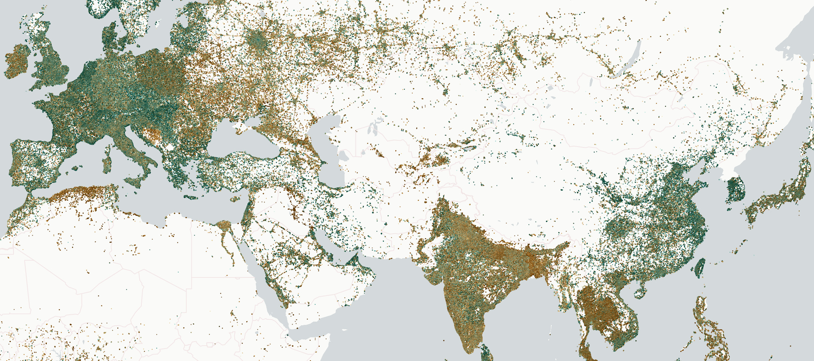
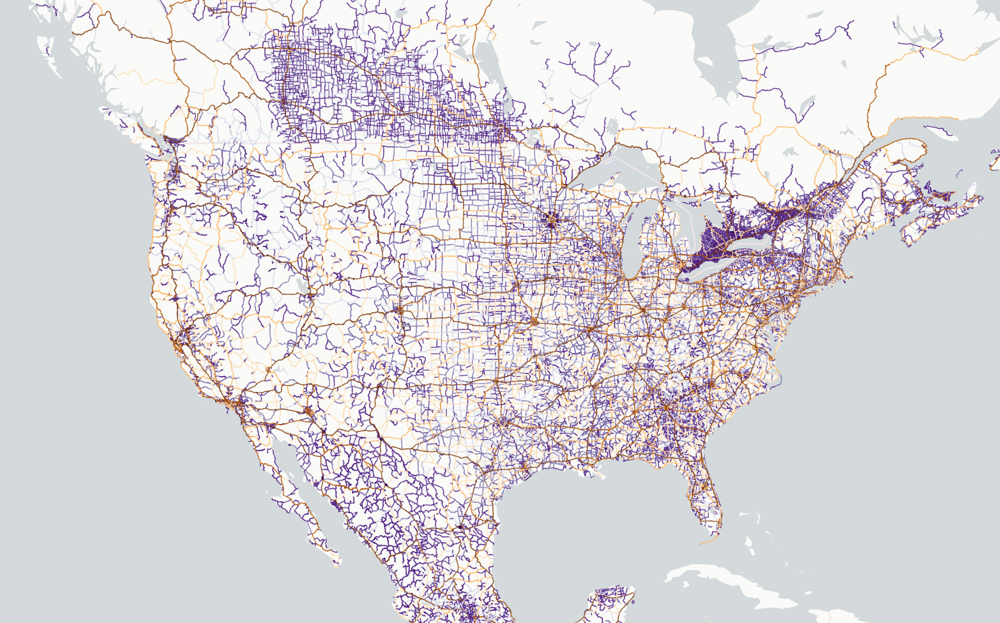
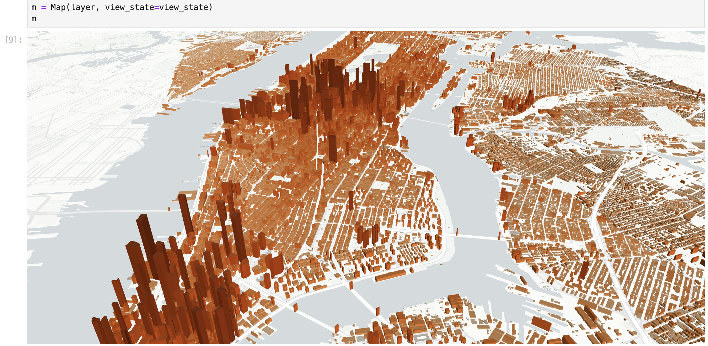
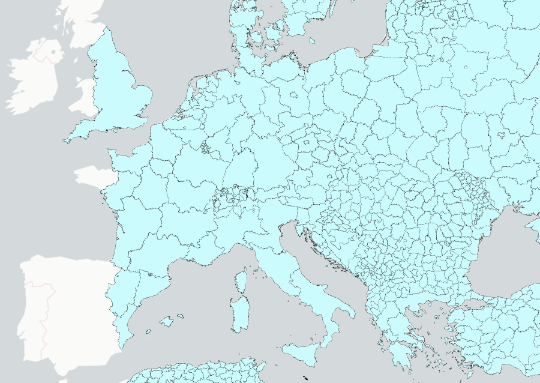
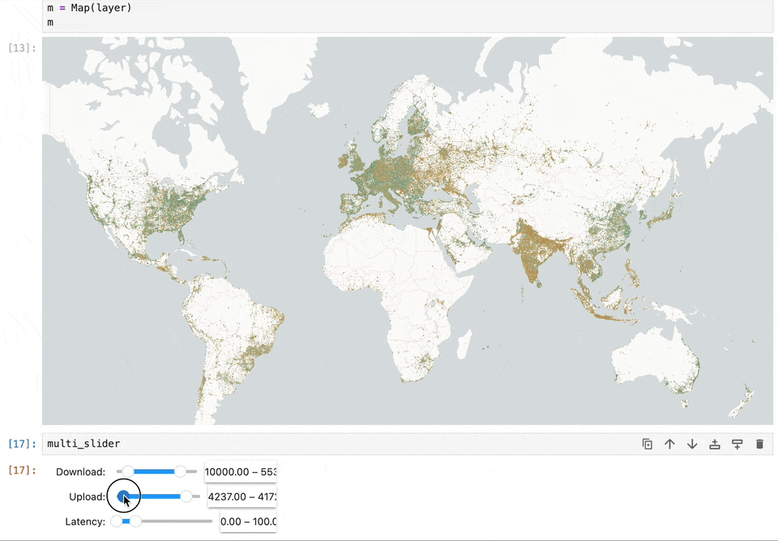
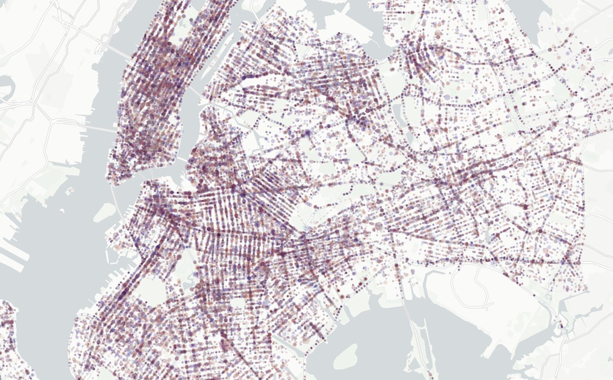
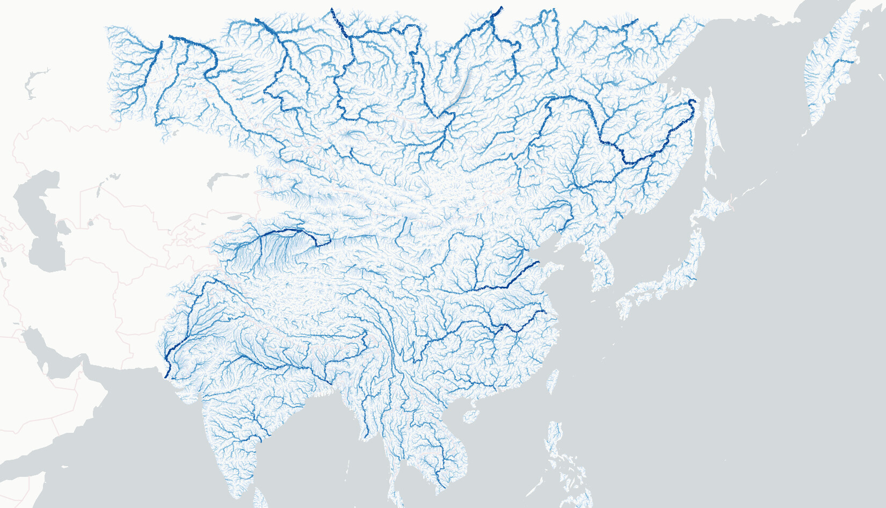
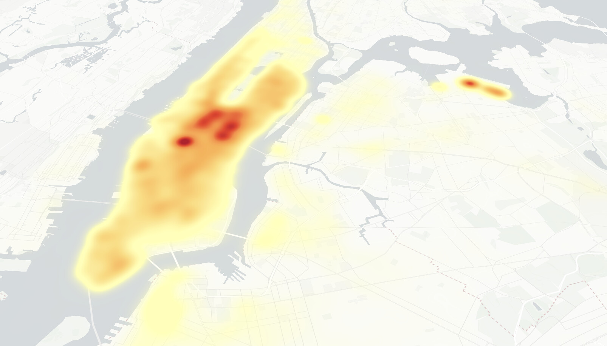
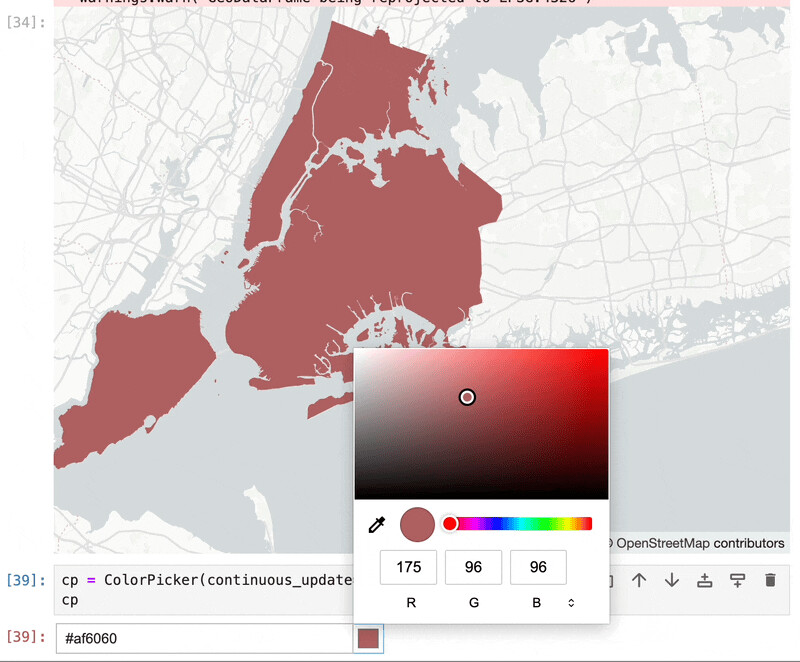
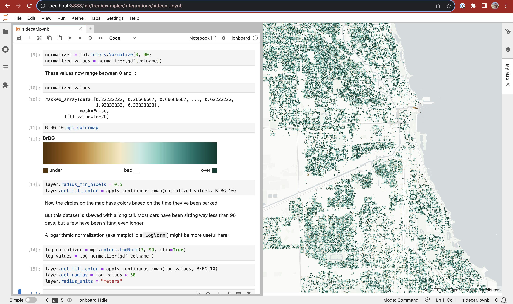

# Examples

- [Speedtest data ](../examples/internet-speeds) using [`ScatterplotLayer`](../api/layers/scatterplot-layer)
- [North America roads ](../examples/north-america-roads) using [`PathLayer`](../api/layers/path-layer)
- [Overture Maps buildings ](../examples/overture-maps) using [`PolygonLayer`](../api/layers/polygon-layer)
- [Global boundaries ](../examples/global-boundaries) using [`PolygonLayer`](../api/layers/polygon-layer)
- [U.S. County-to-County Migration ](../examples/migration) using [`ArcLayer`](../api/layers/arc-layer) and [`BrushingExtension`](../api/layer-extensions/brushing-extension)
- [Scatterplot with GPU data filtering ](../examples/data-filter-extension) using [`ScatterplotLayer`](../api/layers/scatterplot-layer) and [`DataFilterExtension`](../api/layer-extensions/data-filter-extension)
-  [Motor Vehicle Crashes in NYC ](../examples/map_challenge/1-points) using [`ScatterplotLayer`](../api/layers/scatterplot-layer)
-  [Rivers in Asia ](../examples/map_challenge/6-asia/) using [`PathLayer`](../api/layers/path-layer)

## Integrations

-  [DuckDB Spatial ](../examples/duckdb) using [`HeatmapLayer`](../api/layers/heatmap-layer)
-  [Color picker integration ](../examples/integrations/color-picker) using [`SolidPolygonLayer`](../api/layers/solid-polygon-layer)
-  [JupyterLab Sidecar integration ](../examples/integrations/sidecar/) using [`ScatterplotLayer`](../api/layers/scatterplot-layer) and [`JupyterLab Sidecar`](https://github.com/jupyter-widgets/jupyterlab-sidecar)

## Third-party showcase

These examples are maintained by external contributors.

- [American Community Survey exploration ](https://github.com/jaanli/lonboard/blob/1af815ea586121dbbe0d8cae70f7814a642ad165/examples/american-community-survey.ipynb) using [`ScatterplotLayer`](../api/layers/scatterplot-layer) and [`DataFilterExtension`](../api/layer-extensions/data-filter-extension) by [@jaanli](https://github.com/jaanli).

