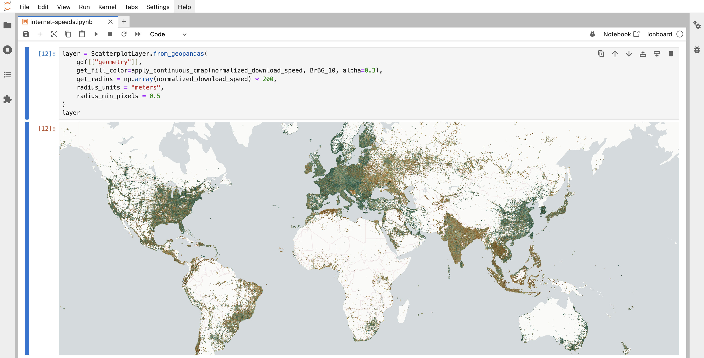
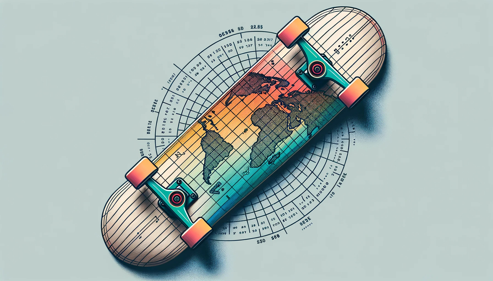

# lonboard

[![PyPI][pypi_badge]][pypi_link]
[![Binder][binder_badge]][binder_jupyterlab_url]
[![open_in_colab][colab_badge]][colab_notebook_link]

[pypi_badge]: https://badge.fury.io/py/lonboard.svg
[pypi_link]: https://pypi.org/project/lonboard/
[binder_badge]: https://mybinder.org/badge_logo.svg
[binder_jupyterlab_url]: https://mybinder.org/v2/gh/developmentseed/lonboard/HEAD?urlpath=lab/tree/examples/
[colab_badge]: https://colab.research.google.com/assets/colab-badge.svg
[colab_notebook_link]: https://colab.research.google.com/github/developmentseed/lonboard/blob/main

A Python library for fast, interactive geospatial vector data visualization in Jupyter.

Building on cutting-edge technologies like [GeoArrow](https://github.com/geoarrow/geoarrow) and [GeoParquet](https://github.com/opengeospatial/geoparquet) in conjunction with [GPU-based map rendering](https://deck.gl/), lonboard aims to enable visualizing large geospatial datasets interactively through a simple interface.



<p align="center">3 million points rendered from a geopandas <code>GeoDataFrame</code> in JupyterLab.</p>

## Install

```
pip install lonboard
```

To install from source, refer to the [developer documentation](https://github.com/developmentseed/lonboard/blob/main/DEVELOP.md).

## Get Started

For the simplest rendering, pass geospatial data into the top-level [`viz` function](https://developmentseed.org/lonboard/latest/api/viz/#lonboard.viz.viz).

```py
import geopandas as gpd
from lonboard import viz

gdf = gpd.GeoDataFrame(...)
viz(gdf)
```

Under the hood, this delegates to a `ScatterplotLayer`, `PathLayer`, or `SolidPolygonLayer`. Refer to the [documentation](https://developmentseed.org/lonboard/) and [examples](https://developmentseed.org/lonboard/latest/examples/internet-speeds/) for more control over rendering.

## Documentation

Refer to the documentation at [developmentseed.org/lonboard](https://developmentseed.org/lonboard/).

## Why the name?

This is a new binding to the [deck.gl](https://deck.gl) geospatial data visualization library. A "deck" is the part of a skateboard you ride on. What's a fast, geospatial skateboard? A <em>lon</em>board.


